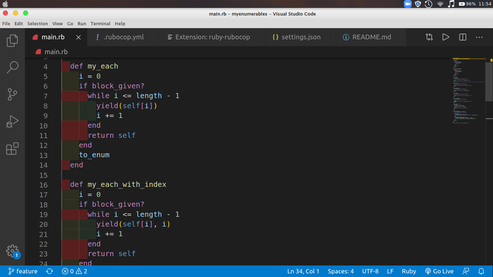

# My Enumerables

## Description

    I made an version of the enumerables methods that can be found on ruby for using in arrays.

## Built With

- Ruby
- Vs Code
- Rubocop

## Live Demo

[Live Demo Link](https://repl.it/@expjazz/GloomyThoughtfulNonlinearprogramming)

## Getting Started

To get a local copy up and running follow these simple example steps.

- Fork the repository
- Install ruby
- Run main.rb

### Prerequisites

- Ruby

### Usage

- Clone the project to your local machine
- Open the run.rb file on your terminal

## Author

- Expedito Andrade

👤 **Expedito Andrade**

- Github: [@githubexpjazz](https://github.com/expjazz)
- Twitter: [@expjazz](https://twitter.com/expeditoandrade13)
- Linkedin: [Expedito Andrade](https://www.linkedin.com/in/expedito-andrade-3645151a4/)
- Email: expeditojazz@gmail.com

## 🤝 Contributing

Contributions, issues and feature requests are welcome!

Feel free to check the [issues page](issues/).

## Show your support

Give a ⭐️ if you like this project!

## Acknowledgments

- Microverse, standup team and the microverse community for helping build the skills that were used on this project

## 📝 License

This project is [MIT](lic.url) licensed.
